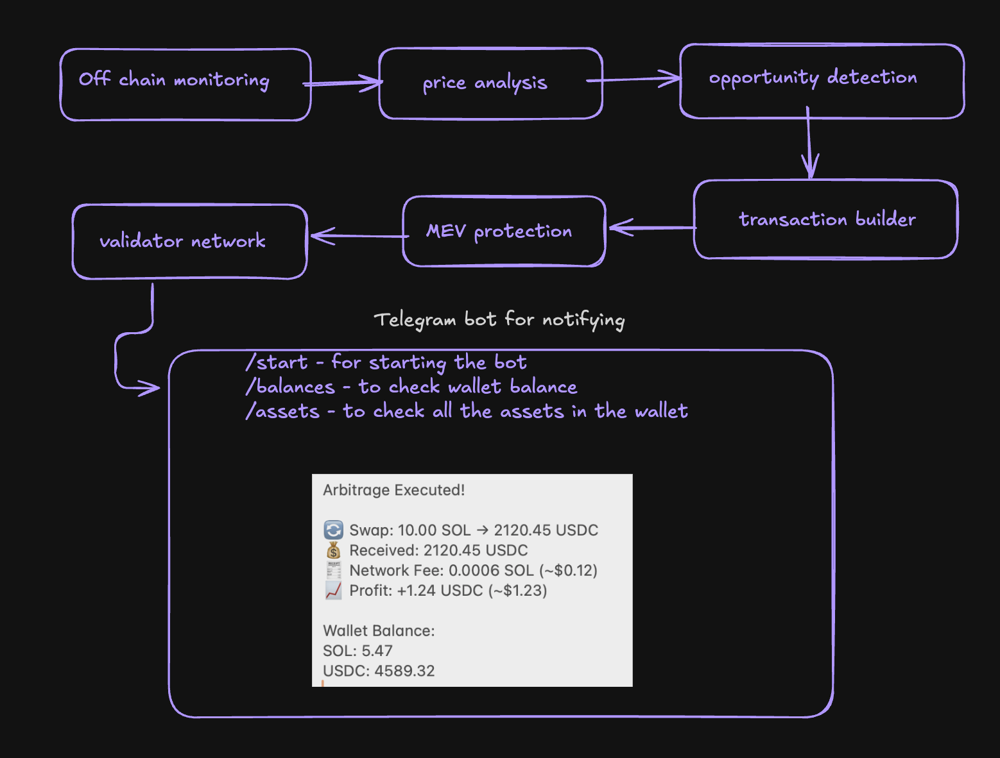
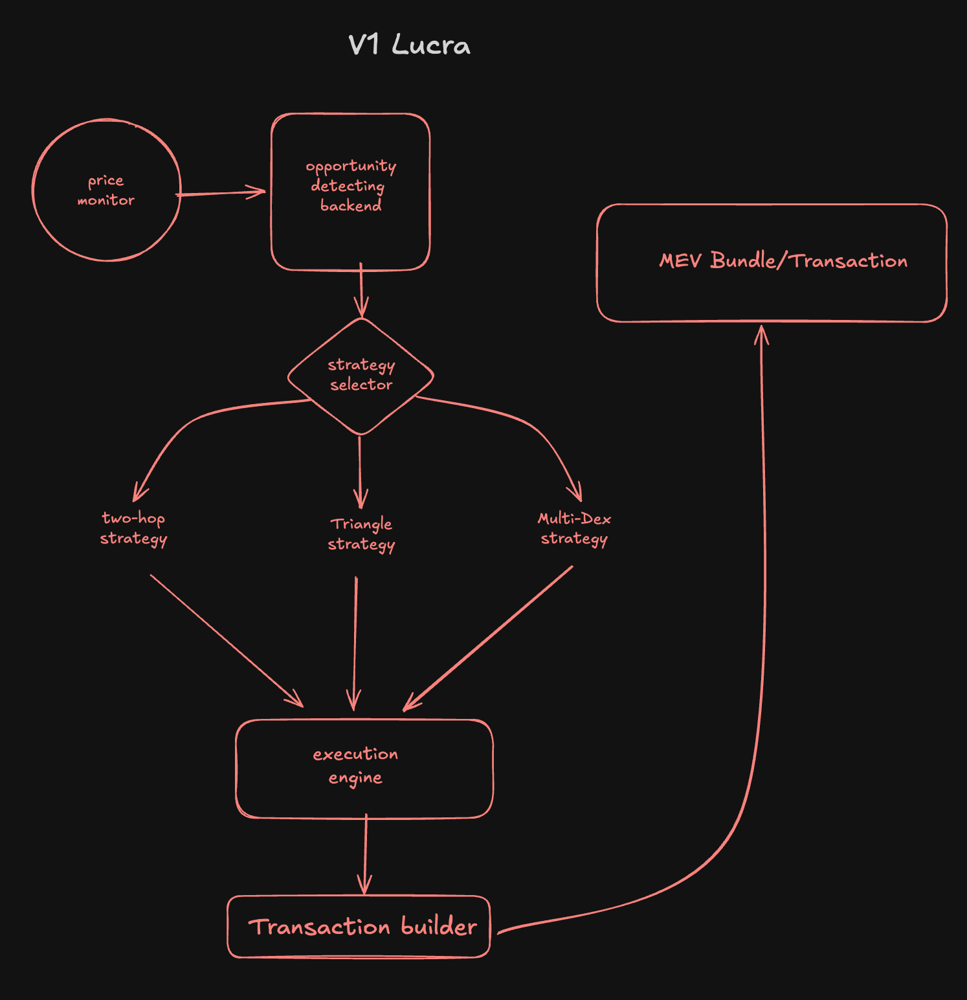

# Lucra: Solana Arbitrage Bot

**Lucra** is an advanced Solana-based arbitrage bot designed to optimize cross-platform trading opportunities. With support for multiple decentralized exchanges (DEXs), Lucra leverages powerful strategies such as the **Two-Hop Strategy**, **Triangle Strategy**, and **Multi-DEX Strategy** to maximize profits by exploiting price discrepancies across the ecosystem.

## How it works ? 
The bot automatically executes trades between different DEXs to buy low on one exchange and sell high on another, ensuring maximum profit by reducing slippage and transaction costs and also notifies the user on telegram .

## Architecture 

## Alternative architecture 
This architecture has a lot of limitations not suitable for our case .
